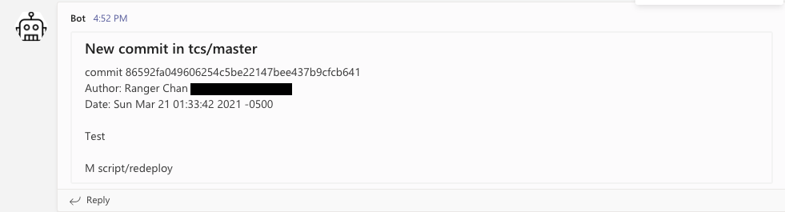
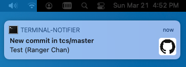

# Git Monitor

Monitor Git repositories for new commits, tags, and branches, and then trigger custom commands.


## How it works

Use `git fectch` and parse its output for changes for new commits, branches, and tags. When detecting any changes, it will trigger all `*.nofity` scripts with some paramters, such as `$title`, `$message`, and `$commit_range`


## How does it look

Teams: (Incoming Webhook):




OSX: (Terminal-notifier)




## Requirements

- Git


## Install

```
git clone https://github.com/rangerz/git-monitor.git ~/.git-monitor
cd ~/.git-monitor
```


### Homebrew

```
brew install ...
```


## Usage

- Add repositories:

```
cd ~/.git-monitor/repos
git clone --mirror https://github.com/joelthelion/autojump.git
git clone --mirror git://github.com/pyromaniac/hoof.git

# Link folder
ln -s /YourProjectPath/ ~/.git-monitor/repos/
```

- Monitor Git repos

```
git monitor # ~/.git-monitor/repos

git monitor ~/watched-repos
```


## Uninstall

```
rm -rf ~/.git-monitor
```

### HomeBrew

```
brew remove ...
```


## TODO

- Add/Remove/List git repositories
- More `*.nofity` scripts, such as slack, message, email, ... etc
- Check desktop nofity works
- Support Windows


## Credits

Inspired by [sickill/git-dude](https://github.com/sickill/git-dude)


## License

[MIT](https://opensource.org/licenses/MIT)


